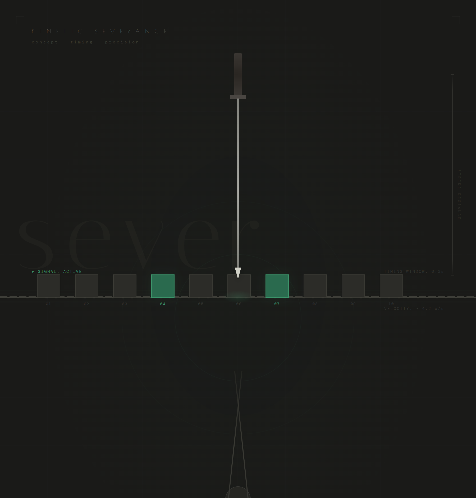

# Kinetic Severance — 切割遊戲

A timing-based cutting game built with HTML5 Canvas.

## Gameplay
- Blocks move along a rope from right to left
- Tap/click to swing the blade down
- **Cut the green blocks** to advance to the next level
- **Avoid cutting gray blocks** — you lose a life
- Difficulty increases each level (faster blocks, fewer greens)

## Tech Stack
- Pure HTML5 Canvas + JavaScript
- No dependencies
- Mobile-friendly (touch support)

## Deploy
Static site — just serve `index.html`.

## Concept Art

